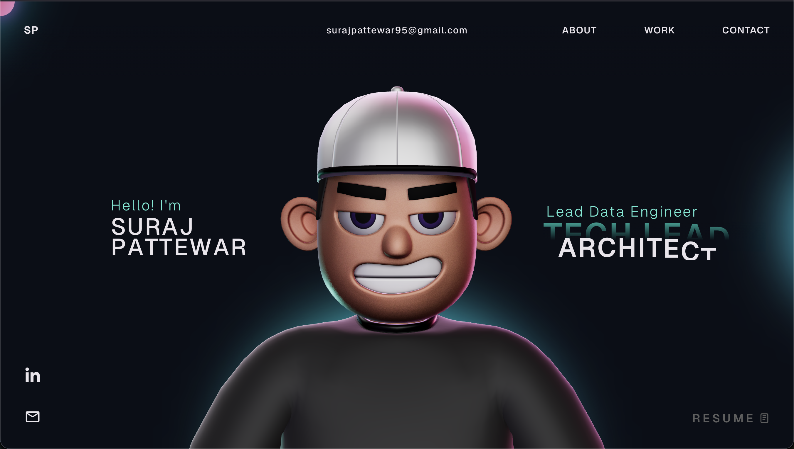

# Suraj Pattewar - Portfolio Website 🚀

This is my personal portfolio website showcasing my work in data analytics, AI/ML, and cloud technologies.



## Tech Stack

- **Frontend**: React, TypeScript, Vite
- **3D Graphics**: Three.js, React Three Fiber, WebGL
- **Animation**: GSAP (GreenSock Animation Platform)
- **Styling**: CSS3, Custom Animations

## Features

- Interactive 3D character model
- Smooth scroll animations
- Tech stack showcase with categories:
  - Data & Analytics
  - AI & Machine Learning
  - Data Integration & Processing
  - Databases
  - Cloud & Infrastructure
- Responsive design
- Dynamic hover effects

## Local Development

```bash
# Install dependencies
npm install

# Run development server
npm run dev

# Build for production
npm run build
```

## Note on GSAP

This project uses GSAP trial plugins for development. For production deployment with GSAP Club plugins, you'll need a GSAP membership. Learn more: https://gsap.com/docs/v3/Installation/

## Credits

This portfolio is customized by Suraj Pattewar, based on the template by [Nisarg Shah](https://github.com/nisarg-shahx/nisarg-shah-portfolio) (which was built upon the foundation of [Rajesh Chityal's portfolio template](https://github.com/Debashtalukder/rajesh-portfolio)).

## License

This project is open source and available under the [MIT License](LICENSE).
